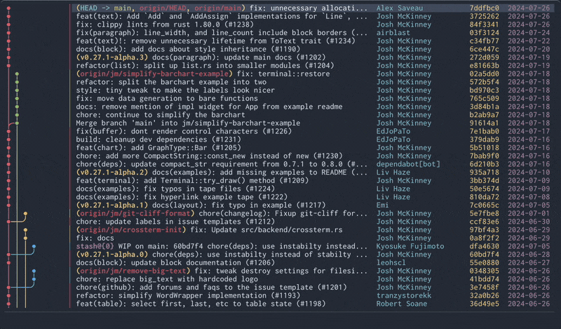

<p align="center">
  <picture>
    <source media="(prefers-color-scheme: dark)" srcset="./assets/brand/mixed-nobg.svg">
    
  </picture>
</p>

<p align="center">

[](https://crates.io/crates/gitoui)
[](https://github.com/NayJi7/gitoui/releases/latest)
[![downloads](https://img.shields.io/crates/d/gitoui?style=flat-square&label=downloads&labelColor=2a2624&color=4b4646&logo=data:image/png;base64,iVBORw0KGgoAAAANSUhEUgAAABAAAAAQCAMAAAAoLQ9TAAAAIGNIUk0AAHomAACAhAAA+gAAAIDoAAB1MAAA6mAAADqYAAAXcJy6UTwAAALNUExURQAAAOq9Z+i1Uui3Wf/CLeW3X+CsR+WzUee4XNecKdedLeW5ZN/Nq+CrQ+XBe+W0VeWuROe3goljOXhcPP/IfBQQCwgGBBcSDKF6T4NnSP///0k5KEU2JuzEeeWzUuWyTue1VOm7Yue/cue2V///9uGuSuSyUee6ZOi4W+m5Xei2Vue0UOi2VtmgMOm5Xui3V+e2Vue6YtaeMuKsQeWxS9ynP+WvReWrOeawSOy8YNqjNuasOuCrQunIhua2WeWyUOe1Vt2pReatPN+rRNupRdynQOKsQuCtSMuVLc6UI+KpOOStQsOMIsOJF9ujN+uzRZRqF7h/DeGpOuGsRVhEKJBoJ8OWTbKNXTInGmlQNnVbOoRgIoxnOpl3UbGOaAAAAAsIBgQDAjAlG3ZaOYpmLp9vF6J9UopnQndWM2VMLwAAAAAAAAsIBUIyIjQoHUMzH41qNohkOnlYNIVmQ4RqTgAAABwVDnFXPJ99WIBgPGRONee7Zee5X92nPOO0WeWyT+e0U+e2Wee7ZOi7ZNujN+OuR+e2V+i7Zei6Yue0Uue2Vue6Yue7Y+KvTOe9bOe6Y+e2WOi0UOeySuSrPOauQNuiNOCsR+CqQeavReKpO+CnNuatPeasOOesONCWItOYJdWbK+GoOMmWMcyYMueuP+muPOivP+S3Xue8admnRcaMGMqPG9CVJN6lN8SSMdOdNemwQemxRNeiPNumPtKdNMONJMaRKsiOHOOqOd6nOuOsPuWvRuKrP9ylOceMGMqPHcyUJ82VKMmULcaOIuGpPOWzUOOuRuSrPdSeNMKQL76DEL+FEsWMHrmDGb2GG8+WJ9+nOOWtPeWsOs+bNMqWMrCDL7iAE7+GFat3EaVzEsWNHuSpN+esOeivPuOqO9GePad3HrF6Dqh0DL+HF+SqOOqxQeauQdShRLGFQbuDFeCnONGjUKaAR7CHTf///zHHVecAAAB7dFJOUwAAAAAAAAAAAAAAAAAAAAAAAAAAAAAAAAAAAAAAAyl61dZ8KAFP3/393ZNCDW/zwWUIbtkbbP7XGw6L1xsBKXfG9tcbEcDXHBXQ2B0Vz9gdGtHZHTTj6jMlocXU9q4hChoyauv29/SyTwwBCBxaeJz58a1LCxA+ub9RC409ZloAAAABYktHRBp1Z+QyAAAACXBIWXMAAAsTAAALEwEAmpwYAAAAB3RJTUUH6gUQATEoEdiP1AAAACV0RVh0ZGF0ZTpjcmVhdGUAMjAyNi0wNS0xNlQwMDozNzo1MSswMDowMAF5a8cAAAAldEVYdGRhdGU6bW9kaWZ5ADIwMjYtMDUtMTZUMDA6Mzc6NTErMDA6MDBwJNN7AAAAKHRFWHRkYXRlOnRpbWVzdGFtcAAyMDI2LTA1LTE2VDAxOjQ5OjQwKzAwOjAwp4gFOwAAARtJREFUGNMBEAHv/gAAAAABHR4fICEiIyQCAwQFAAAAAAYlJid7fCgpKissBwgAAAAACS19fn+AgYKDLi8wMQAAAAAKMoSFhoeIiYqLjDM0AAALDA01jY6PkJGSNpOUNzgADg8QOTqVlpeYmZqbnJ07PAA9Pj9AQZ6foKGio6SlpkJDAERFp6ipqqusra6vsLGKRkcASEmys7S1tre4ubq7vL1KSwBMTb6/wMHCw8TFxsfIyU5PAFBRysvMzc7P0NHSm9PUUlMAVFXV1tfY2drbndzd3t9WVwBYWVpb4OHi4+Tl5ufoXF1eAF9gYWJjZGXp6uvsZmdoaREAAGprbG1ub3DtcXJzdBITFAAVFgAXanV2d3h5ehgZGhscUylwWHg1JvEAAAAASUVORK5CYII=)](https://crates.io/crates/gitoui)
[](https://github.com/NayJi7/gitoui/stargazers)
[](https://ratatui.rs)

</p>

<p align="center"><em>Say <strong>oui</strong> to the smoothest git terminal youser experience.</em></p>

<p align="center">
  <!-- ▶ demo GIF — full app walkthrough -->
  
</p>

**gitoui** ([`/ʒi.tu.i/`](https://nayji7.github.io/gitoui/faq/#how-do-i-pronounce-gitoui)) is a terminal git client. It started as a fork of [serie](https://github.com/lusingander/serie) — a beautifully-rendered `git log --graph` viewer — and grew into a daily-driver TUI that covers diffs, staging, blame, history, interactive rebase, conflict resolution, and GitHub Pull Requests / Issues.

## What's inside

The commit graph stays serie's: pre-rendered SVGs sent inline through your terminal's image protocol (Kitty, iTerm2, Ghostty, Sixel). Around it, gitoui adds the operations you do on top of `git log`:

- Side-by-side or inline diffs with `git add -p`-style hunk staging baked into the Uncommitted view.
- `b` to blame, `Shift+H` to follow file history across renames.
- Mark two commits with `Space` for a cumulative diff between them.
- Visual interactive rebase: grab + drop rows, reword in place, pause + resume modes.
- 3-way conflict editor — pick OURS / THEIRS / BOTH per hunk, no need to drop to vimdiff.
- Full GitHub workflow: PR + Issue threads, reviews, reactions, labels, assignees, mention autocomplete, comment CRUD.
- Inline GitHub avatars rendered through the same image protocols as the graph.
- Two-layer keybinds: global `[keybind]` UserEvents plus per-view `[keybind.scope.<path>]` overrides.
- Ten built-in themes (Tokyo Night, Dracula, Catppuccin, Gruvbox, Nord, Solarized, One Dark, Monokai Pro), and a `.toml` in `~/.config/gitoui/themes/` for your own.

Full feature tour at [nayji7.github.io/gitoui/introduction/](https://nayji7.github.io/gitoui/introduction/).

## Install

One-liner for Linux + macOS (auto-detects OS/arch, drops `gitoui` into `~/.local/bin`):

```sh
curl -fsSL https://nayji7.github.io/gitoui/install.sh | sh
```

Or via Cargo from crates.io:

```sh
cargo install gitoui
```

For pinned versions, manual downloads, or building from source, see the [installation guide](https://nayji7.github.io/gitoui/getting-started/installation/).

## Quick start

```sh
cd <your git repo>
gitoui
```

Press `?` for the keymap, `q` to quit. Full docs at [nayji7.github.io/gitoui](https://nayji7.github.io/gitoui/).

## Contributing

Open source, open arms — PRs are welcome. See [CONTRIBUTING.md](CONTRIBUTING.md) for the dev setup and workflow.

## License

[MIT](LICENSE)

---

Forked from [serie](https://github.com/lusingander/serie). Inspired by [GitKraken](https://www.gitkraken.com/) and the [Git Graph](https://marketplace.visualstudio.com/items?itemName=mhutchie.git-graph) VS Code extension.
